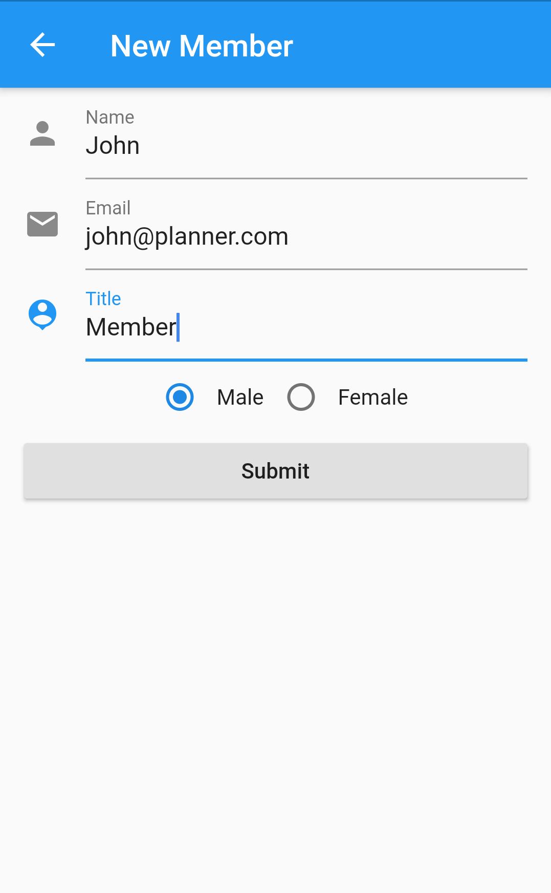
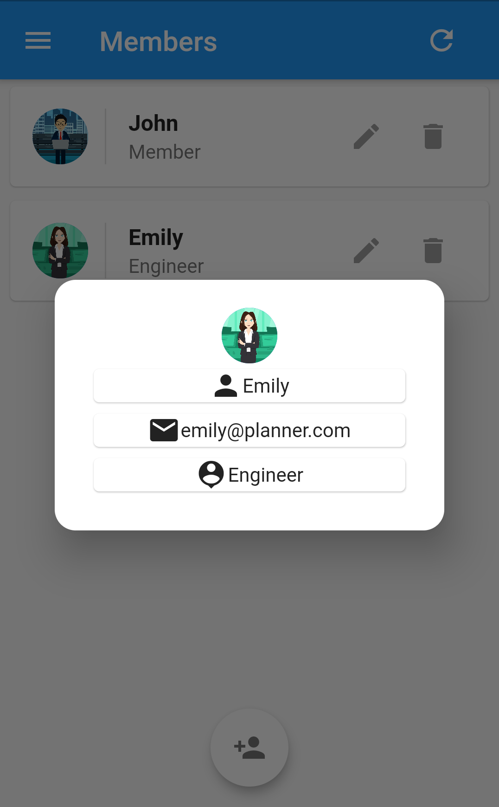
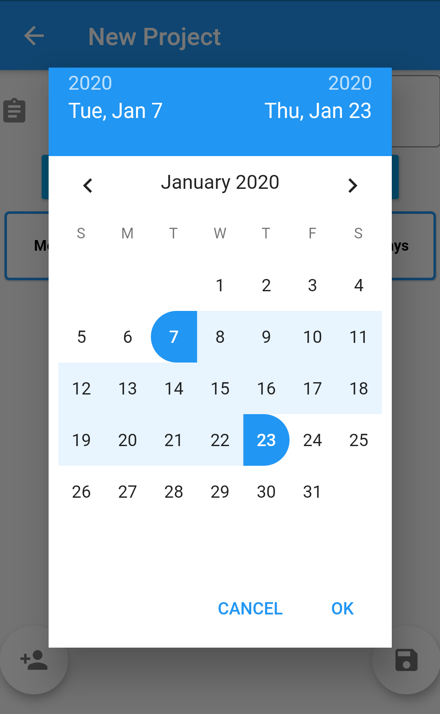
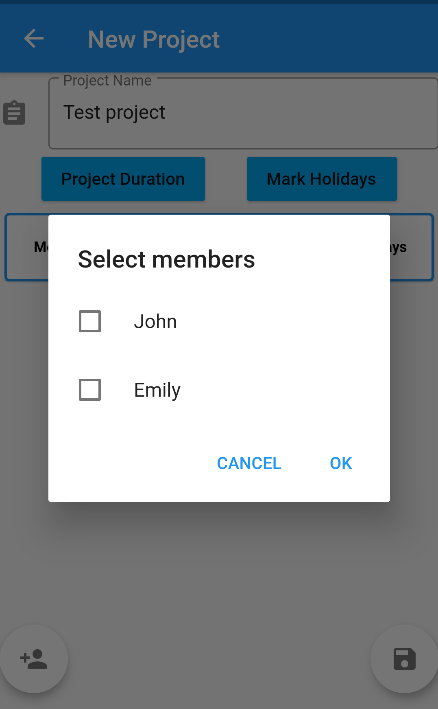
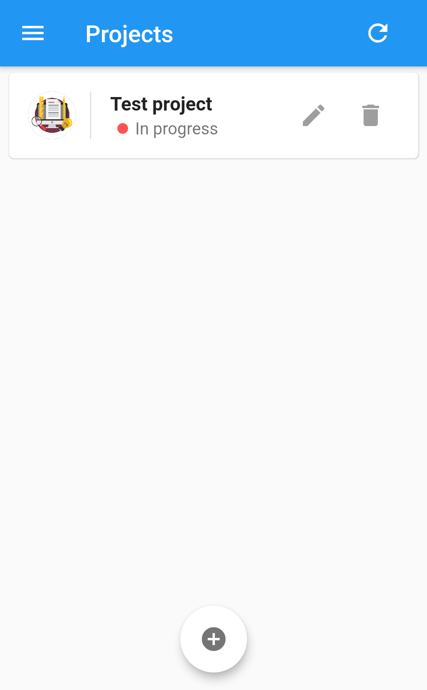
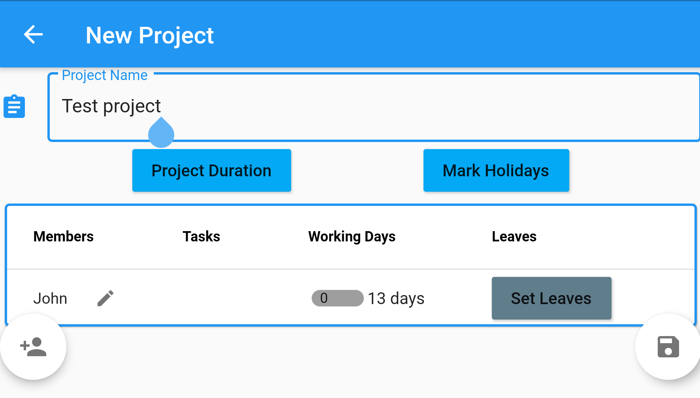
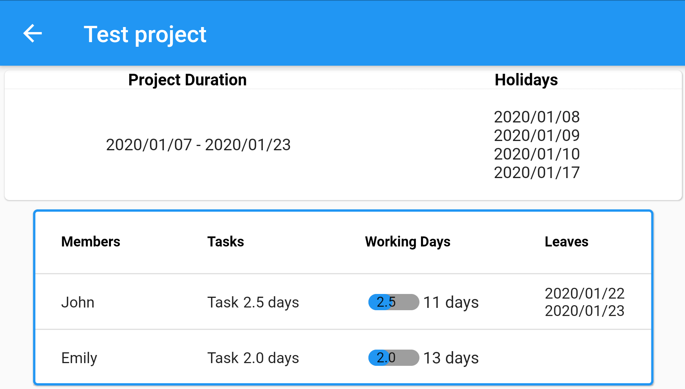

# Planner

##### Simple application to manage projects among your team members.
Play store : https://play.google.com/store/apps/details?id=com.proxyLabs.planner

This application is mainly developed to easily manage projects among team members. 
Application has the ability to add members and create project sheets.
Through project sheets you can  
1. Select members for the projects
2. Define project duration
3. Mark holidays within project period
4. Mark leaves of project members
5. Delegate task to project members 
6. Allocate time to finish the tasks
	
Check the instruction page in the application or <a href="https://youtu.be/s40YZ2oIuUc" target="_top">intro video</a> to identify the functionality. 

 

##### Screen shots of the applications 

<kbd>
  
  
  
  
  
  
 
</kbd>